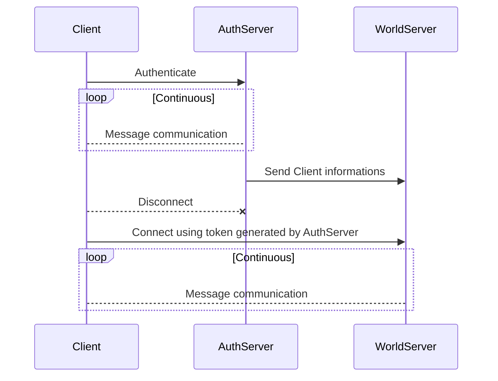
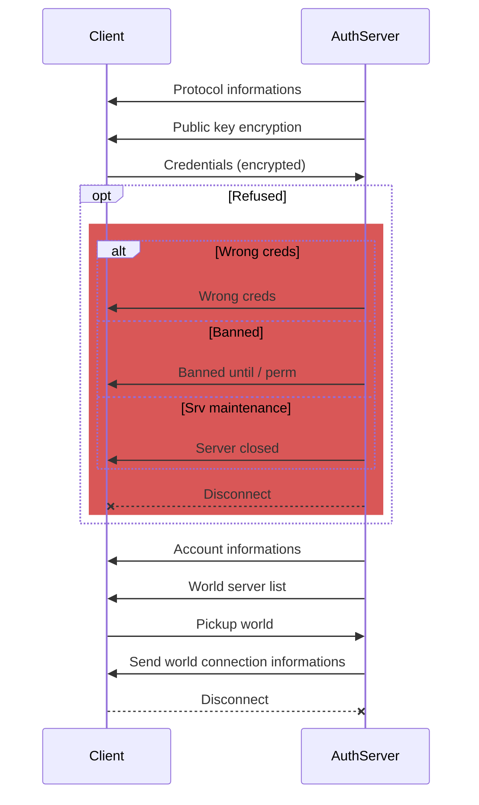
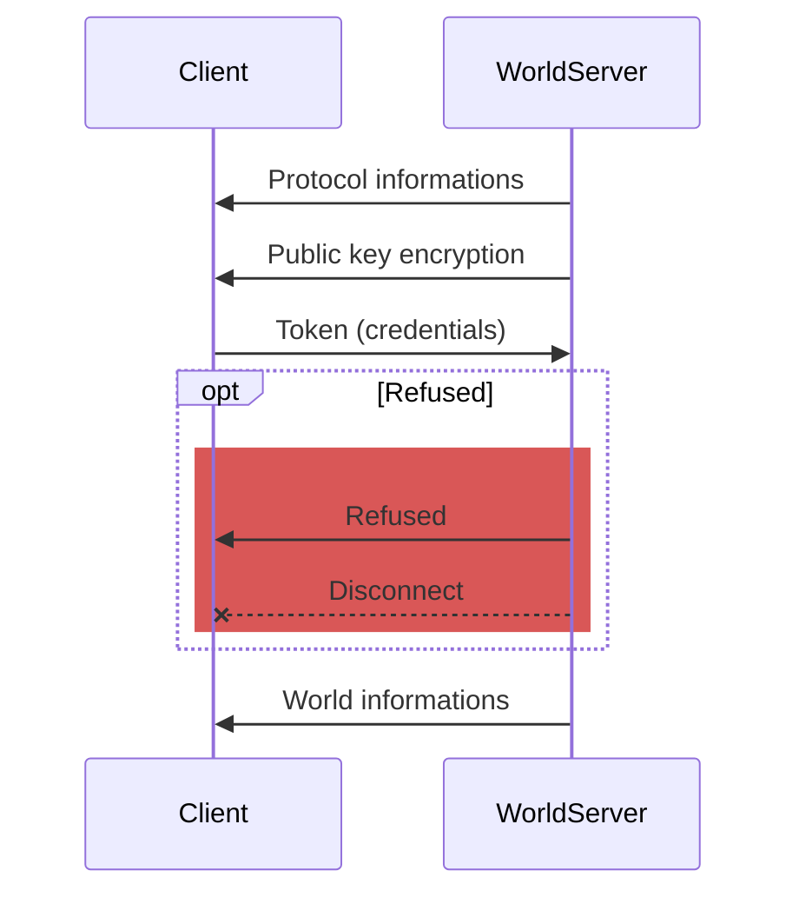

# Communication Charts

### Wide angle connection chart

```mermaid
sequenceDiagram
participant C as Client
participant A as AuthServer
participant W as WorldServer
C ->> A: Authenticate

loop Continuous
    C --> A: Message communication
end

A ->> W: Send Client informations
C --x A: Disconnect
C ->> W: Connect using token generated by AuthServer

loop Continuous
    C --> W: Message communication
end
```

### AuthServer packet diagram

```mermaid
sequenceDiagram
participant C as Client
participant A as AuthServer

A ->> C: Protocol informations
A ->> C: Public key encryption
C ->> A: Credentials (encrypted)

opt Refused
    rect rgb(217, 87, 87)
        alt Wrong creds
            A ->> C: Wrong creds
        else Banned
            A ->> C: Banned until / perm
        else Srv maintenance
            A ->> C: Server closed
        end
        A --x C: Disconnect
    end
end

A ->> C: Account informations
A ->> C: World server list
C ->> A: Pickup world
A ->> C: Send world connection informations
C --x A: Disconnect
```
### WorldServer packet diagram

```mermaid
sequenceDiagram
participant C as Client
participant W as WorldServer

W ->> C: Protocol informations
W ->> C: Public key encryption
C ->> W: Token (credentials)

opt Refused
    rect rgb(217, 87, 87)
        W ->> C: Refused
        W --x C: Disconnect
    end
end

W ->> C: World informations
```

